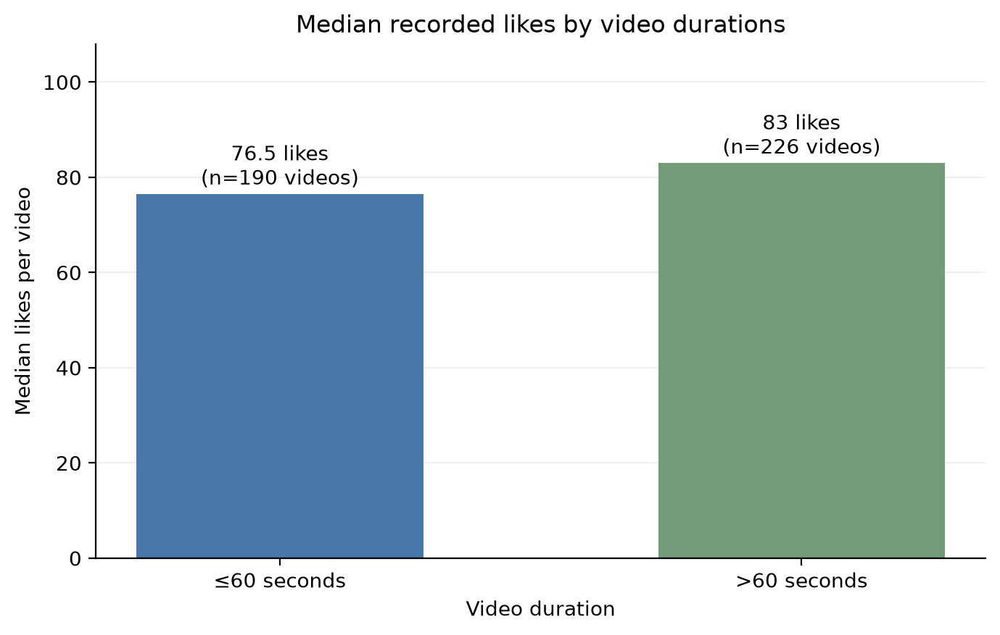

# Sichuan Opera Video Engagement Analysis

## Business Problem

Social media offers the Sichuan Opera Troupe
(Chinese name: 四川省川剧院) a way to introduce its performances to potential audiences.
Online content may build interest in Sichuan opera and encourage people
to consider attending a performance.

However, followers, engaged viewers, and ticket buyers are overlapping
but distinct groups. Following an account does not necessarily mean
interacting with its videos or purchasing tickets. This project therefore
treats online interaction as one aspect of audience development, rather
than direct evidence of ticket demand.

### Content Decision
For a social media manager, one practical decision is how long videos
should be. This project investigates whether shorter and longer videos
receive different levels of interaction, with the aim of identifying
video lengths worth testing in future content.

### Research Question

How does video duration relate to recorded likes, comments, and shares
on the theatre’s Douyin (Tic Tok) account, and which video lengths should be
prioritised for further testing?

### Working Hypothesis

Videos lasting 60 seconds or less tend to receive higher interaction
counts than videos longer than 60 seconds. This is a hypothesis to
evaluate, not an established finding. The analysis will also examine
duration more broadly to avoid relying entirely on one cutoff.

### Decision Supported

The findings will help a hypothetical social media manager choose video
lengths for a future content experiment and decide whether shorter edits
of performance footage are worth testing.

### Scope and Limitations
This independent portfolio project examines video duration and
interaction counts. It does not measure follower growth, audience age,
or ticket purchases. Findings will describe associations rather than
establish that video length causes engagement or sales.

### Initial finding

The initial comparison does not support the hypothesis that videos lasting
60 seconds or less receive higher interaction counts. Among 416 eligible
videos, median likes were 76.5 for shorter videos and 83 for longer videos.
Median comments were also slightly higher for longer videos.

These descriptive differences do not establish that longer videos perform
better because of their duration. Publication dates and view counts are
unavailable, and content characteristics may differ between groups.
Further analysis will examine the distributions and whether the pattern
is consistent across duration ranges.

At this stage, the evidence does not justify recommending that the theatre
shorten all videos. A useful next step would be to test shorter and longer
versions of comparable content and measure their performance over the
same observation period.

